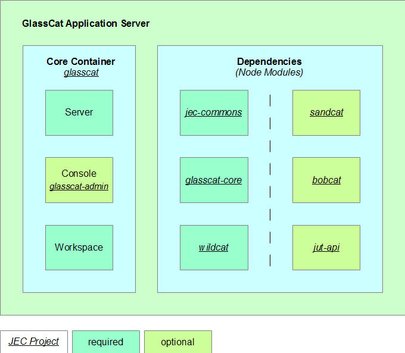

# JavaScript Entreprise Container *(JEC)* Projects

JavaScript Entreprise Container *(JEC)* is the standard in modern JavaScript enterprise software.

[![][jec-logo]][jec-url]

JEC intends to provide a well defined and easy-to-use infrastructure to JavaScript developers, with the following advantages:
- a standardized development environment
- an efficient alternative to Java EE
- an integrated solution for modern Web development
- an effective solution for JavaScript apps scalability 

Short presentations of JEC technologies are available from the [JEC/presentations](presentations) folder.

**The current repository only contains information about the different JEC technologies available at [github.com/pechemann](https://github.com/pechemann).**

## Table of Contents
* [GlassCat Application Server](#glasscat-application-server)
  * [GlassCat In Action](#glasscat-in-action)
  * [Jslet Technology](#jslet-technology)
  * [Entreprise JavaScript Projects *(EJP)*](#entreprise-javascript-projects-ejp)
  * [Non-blocking Architecture](#non-blocking-architecture)
  * [Final Architecture](#final-architecture)
* [Sandcat: RESTful Services For JavaScript Applications](#sandcat-restful-services-for-javascript-applications)
* [Bobcat: Dependency Injection and IoC Framework](#bobcat-dependency-injection-and-ioc-framework)
* [Wildcat: EJP Archetypes Manager](#wildcat-ejp-archetypes-manager)
  * [Why an Archetypes Manager?](#why-an-archetypes-manager)
* [JavaScript Unit Testing API](#javascript-unit-testing-api)
* [JEC Projects Repositories](#jec-projects-repositories)
* [JEC Samples Repositories](#jec-samples-repositories)
* [Roadmap](#roadmap)
* [License](#license)

## GlassCat Application Server
<p align="center">
  
</p>

GlassCat is a **Web Applications Server** which provides advanced functionalities for creating and deploying JavaScript projects built on top of the JEC specification.

### GlassCat In Action

You can refer to the [JEC Youtube Channel](https://www.youtube.com/channel/UCA2Z3RDl6NET9qRH-HbNktQ) to watch video presentations about GlassCat, including:
- deployment of Angular apps
- creation of RESTful services
- Dependency Injection and IoC
- stateless/stateful applications
- etc.

### Jslet Technology

Jslets are part of the JEC specification and provide the main implementation of the GlassCat Application Server technology. They are designed on the same model as the JEE servlet specification and provide a standardized structure for building scalable JavaScript applications.

Jslets also define the base structure for the JavaScript API for RESTful Services *(JARS)* specification and the JEC security layer. 

### Entreprise JavaScript Projects *(EJP)*

A JEC application is delivered in an Entreprise JavaScript Project *(EJP)* file. No extra coding is needed. EJPs supply portability to JavaScript applications and are easy to share.

Final version of the JEC specification will introduce the possibility to package multiple Entreprise JavaScript Modules *(EJM)* within a single EJP.

### Non-blocking Architecture

GlassCat takes benefits of the [Node.js Non-blocking I/O](https://nodejs.org/en/docs/guides/blocking-vs-non-blocking/) and Event Driven architecture to provide developers a powerful platform for building high concurrency Web applications.

Thus, GlassCat is the perfect solution for building distributed applications such as:
- RESTful services
- Big data softwares
- Single Page Applications 

### Final Architecture

The [jec-glasscat-poc-src](https://github.com/pechemann/jec-glasscat-poc-src) repository contains the source code for the current GlassCat release.

Current version is a very advanced release of Glasscat which demonstrates the feasibility and the viability of the JEC technologies. Release Candidate versions will be similar to the current implementation, except for the dependencies architecture.

At the moment, all JEC default implementation projects are contained in this repository, for faster development. The final architecture implies that all of this projects will be splitted into smaller packages. These packages will be delivered as [npm](https://www.npmjs.com/) dependencies of the GlassCat server:

<p align="center">
  
</p>

Final architecture will provide developers the ability to develop their own modules and implementations to extend JEC.

Moreover, import statements will be more concise and well-defined. For example, the following import statements :

```javascript
import {HttpRequest} from "../../../../server/com/jec/commons/jslet/http/HttpRequest";
import {ResourcePath} from "../../../../server/com/onsoft/sandcat/annotations/ResourcePath";
```

will be replaced by these ones:

```javascript
import {HttpRequest} from "jec-commons";
import {ResourcePath} from "jec-jars";
```

## Sandcat: RESTful Services For JavaScript Applications

The JARS specification defines a set of Java APIs for the development of Web services built according to the Representational State Transfer (REST) architectural style. Sandcat is the default GlassCat implementation for the JARS specification.

 A Sandcat application is packaged as a Web application in a [EJP, or EJM](#entreprise-javascript-projects-ejp), file. Using JARS a Web resource is implemented as a resource class and requests are handled by resource methods. It uses specific [TypeScript decorators](https://www.typescriptlang.org/docs/handbook/decorators.html) (such as `@ResourcePath`, `@GET`, etc.) to describe resources.

 > By using the **JavaScript Connector API for Descriptors** *(JCAD)*, developers can create their own frameworks to implement the JARS specification.

## Bobcat: Dependency Injection and IoC Framework

The JavaScript Dependency Injection *(JDI, pronounce JEDI)* specification defines the API that provides the ability to inject components into an application in a typesafe way. It introduces Inversion of Control *(IOC)* through JavaScript components, for whom lifecycle is managed by the container, according to the lifecycle context model defined by developers.

Bobcat is the default GlassCat implementation for the JDI specification. JDI implementations are built on the top of the [TypeScript decorators](https://www.typescriptlang.org/docs/handbook/decorators.html) API. Decorators (`@Inject`, `@Injectable`, `@Qualifier`, etc.) make DI and IoC easier to use and clearer to read and maintain.

 > By using JCAD, developers can create their own frameworks to implement the JDI specification.

## Wildcat: EJP Archetypes Manager

Wildcat is an archetype manager that deploys EJP projects, exactly as Maven do in Java world. Wildcat is integrated to the Glasscat administration console, which gives developers an easy-to-use all-in-one tool for creating any kind of JEC projects. Moreover, you can use the command-line user interface to deploy archetypes without opening the admin console.

### Why an Archetypes Manager?

The standard way to deploy JavaScript projects is to install archetypes from remote repositories (e.g. GuitHub). But, regarding Java technologies, enterprises often use Maven to deploy custom archetypes from local repositories. So, Wildcat has been designed to offer such a level of functionalities.

Anyway, JEC projects archetypes can be deployed from your GitHub repositories.

## JavaScript Unit Testing API

The JavaScript Unit Testing API *(JUTA)* is an experimental project which aims to provide developers a superset API to simplify JEC projects unit tests.

JUTA is based on the [TypeScript decorators](https://www.typescriptlang.org/docs/handbook/decorators.html) decorators API and is not not implementation dependent. It will be the base for all JEC projects tests, including GlassCat and the JEC default implementations.

## JEC Projects Repositories

The following projects, available at [github.com/pechemann](https://github.com/pechemann), are either parts of the JEC specifications, or their default implementations:
- **[JEC](https://github.com/pechemann/JEC)**: solely contains presentation documents related to the JEC project.
- **[jec-glasscat-poc-src](https://github.com/pechemann/jec-glasscat-poc-src)**: contains all functional initial sources of the GlassCat server and the default JEC implementations. This project demonstrates the Proof Of Concept of the JEC technologies. It is an early preview of the GlassCat Application Server which does not respect the [final architecture proposal](#final-architecture). Thus, this repository will be deleted after the release of GlassCat RC-* versions.
- **[jec-spec](https://github.com/pechemann/jec-spec)**: contains the JEC specifications.
- **[jec-jars-spec](https://github.com/pechemann/jec-jars-spec)**: contains the JavaScript API for RESTful Services *(JARS)*  specifications.
- **[jec-jdi-spec](https://github.com/pechemann/jec-jdi-spec)**: contains specification of the JavaScript Dependency Injection *(JDI)* for JEC applications. 
- **[jec-juta-spec](https://github.com/pechemann/jec-juta-spec)**: contains the JavaScript Unit Testing API *(JUTA)* specifications.
- **[jec-commons](https://github.com/pechemann/jec-commons)**: contains common dependencies shared by JEC implementations.
- **[jec-commons-node](https://github.com/pechemann/jec-commons)**: contains common dependencies shared by JEC implementations built on top of Node.js.
- **[jec-exchange](https://github.com/pechemann/jec-exchange)**: contains jslet and security layers dependencies.
- **[jec-jars](https://github.com/pechemann/jec-jars)**: contains dependencies shared by JARS implementations.
- **[jec-jdi](https://github.com/pechemann/jec-jdi)**: contains dependencies shared by JDI implementations.
- **[jec-juta](https://github.com/pechemann/jec-juta)**: contains dependencies shared by JUTA implementations.
- **[jec-glasscat](https://github.com/pechemann/jec-glasscat)**: the official GlassCat Application Server repository.
- **[jec-glasscat-core](https://github.com/pechemann/jec-glasscat-core)**: contains the GlassCat Application Server core components.
- **[jec-glasscat-admin](https://github.com/pechemann/jec-glasscat-admin)**: the GlassCat Administration Console repository.
- **[jec-sandcat](https://github.com/pechemann/jec-sandcat)**: the official Sandcat repository; Sandcat is the default implementation of the JARS specification.
- **[jec-bobcat](https://github.com/pechemann/jec-bobcat)**: the official Bobcat repository. Bobcat is the default implementation of the JDI specification.
- **[jec-wildcat](https://github.com/pechemann/jec-wildcat)**: the official Wildcat repository; Wildcat is the default archetypes manager for the GlassCat Application Server.
- **[jec-tiger](https://github.com/pechemann/jec-tiger)**: the GlassCat JUTA implementation, based upon the [Mocha JavaScript test framework](https://mochajs.org/).

## JEC Samples Repositories

The following projects, available at [github.com/pechemann](https://github.com/pechemann), provide developers fully functional examples based upon the JEC specifications:

- **[jec-sample-tiger](https://github.com/pechemann/jec-sample-tiger)**: a simple project that shows how to write unit tests by using the [JUTA specification](https://github.com/pechemann/jec-juta) and the [Tiger framework](https://github.com/pechemann/jec-tiger).
- **[jec-sample-glasscat](https://github.com/pechemann/jec-sample-glasscat)**: contains [GlassCat](https://github.com/pechemann/jec-glasscat) sample applications.

## Roadmap

*Not available yet.*

## Author

GlassCat and all JEC technologies have been created by [Pascal ECHEMANN](https://www.linkedin.com/in/echemann/) and are freely inspired by JAVA EE.

Pascal is a Flash&reg; Platform Technical Expert who focuses on innovative Web technologies, including modern JavaScript, such as Node.js and Angular. He has over 12 years experience in the development of high-level User Interface frameworks. He also works on the interactions between the different display devices, or mashup services, and the way to unify the aspects of business layers through text-based communication models.

Pascal has created and developed, among other things, the following frameworks and APIs:
- [WOOZ](http://wooz.io): a FLEX-like framework built in JavaScript
- [Swing Package for ActionScript 3.0](http://flashapi.org/) a complete application framework built in ActionScript
- [ONYX Online Operating System](https://www.youtube.com/user/SpasOS1): an Online Operating System which brings together, tools for processing data, personal information and all kind of media
- [Hummingbird MVC Framework](http://wooz.io): a Free and Open Source MVC Framework, based on IoC and DI to deal for you with the MVC pattern architecture over the Flash&reg; Platform

You can contact Pascal from his [linkedin profile](https://www.linkedin.com/in/echemann/).

## License
This work and the content of the [`assets`](assets) package are licensed under Apache 2.0. Full license text is available in [COPYING](COPYING).

The content of the [`presentations`](presentations)  package is licensed under the *French copyright terms*, defined in the first book of the [Code of intellectual property](https://www.legifrance.gouv.fr/affichCode.do?cidTexte=LEGITEXT000006069414&dateTexte=20170409).

[jec-url]: https://github.com/pechemann/JEC
[jec-logo]: https://raw.githubusercontent.com/pechemann/JEC/master/assets/jec-logos/jec-logo.png